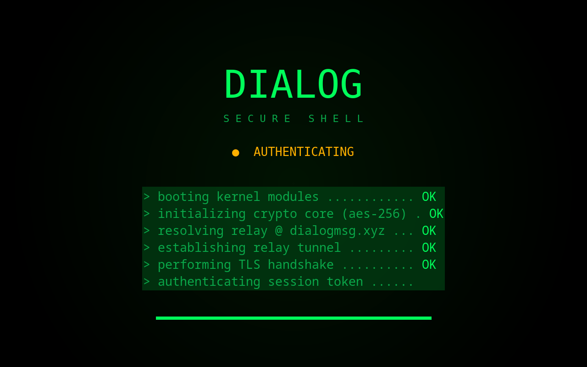

<div align="center">


# Dialog

**A fast, secure messenger — chat, group voice & video calls, and screen sharing.**
In your browser, on your desktop, and on Android.

[](https://dialogmsg.xyz)
[](https://dialogmsg.xyz/download)
[](LICENSE)


[**Open Dialog →**](https://dialogmsg.xyz/login) · [Download apps](https://dialogmsg.xyz/download) · [Privacy](https://dialogmsg.xyz/privacy)



</div>

---

## Features

- **Instant messaging** — direct & group chats with reactions, edits, replies, voice notes, GIFs and file sharing.
- **Group voice & video calls** — low-latency, powered by a [LiveKit](https://livekit.io) media server.
- **Screen sharing** — share your screen in any call.
- **Native desktop apps** — Windows, macOS & Linux, with a system tray, auto-update, and a frameless boot screen.
- **Android app** — native WebView wrapper with native notifications.
- **Presence & privacy** — online / do-not-disturb / invisible status, friend & block lists.
- **Self-hostable** — bring your own server; you control the data.

## Download

Get the app for your platform at **[dialogmsg.xyz/download](https://dialogmsg.xyz/download)**, or grab them from
[GitHub Releases](https://github.com/VanylixCODER/Dialog/releases). No install? Just use it in your
browser at **[dialogmsg.xyz](https://dialogmsg.xyz/login)**.

| Platform | Format |
|---|---|
| Windows | `.exe` installer |
| macOS | `.dmg` / `.zip` (universal) |
| Linux | AppImage · `.deb` · `.pacman` · Flatpak |
| Android | `.apk` |

## Tech stack

Node.js · Express · Socket.IO · MySQL · Redis · LiveKit (calls) · Web Push ·
Electron (desktop) · Android WebView (Kotlin). No build step for the frontend —
it's plain ES modules.

## Run it yourself

Requirements: Docker (or Node 20+, MySQL 8, optional Redis).

```bash
git clone https://github.com/VanylixCODER/Dialog.git
cd Dialog
docker compose up -d     # starts the app + MySQL + Redis
# → http://localhost:3000
```

Or without Docker: `npm install && npm start` (point `DB_*` at your MySQL).

### Key environment variables

| Var | Purpose |
|---|---|
| `DB_HOST` / `DB_PORT` / `DB_USER` / `DB_PASS` / `DB_NAME` | MySQL connection (set `DB_PORT=3306` explicitly) |
| `REDIS_URL` | Optional Redis cache (e.g. `redis://localhost:6379`) |
| `LIVEKIT_URL` / `LIVEKIT_API_KEY` / `LIVEKIT_API_SECRET` | Group calls (LiveKit) |
| `TURN_URL` / `TURN_USER` / `TURN_PASS` or `METERED_API_KEY` | TURN relay for calls |
| `VAPID_PUBLIC` / `VAPID_PRIVATE` / `VAPID_SUBJECT` | Web Push notifications |
| `GIPHY_KEY` | GIF search |
| `PORT` | Server port (default `3000`) |

## Apps & releases

- Desktop & Android shells live in [`desktop/`](desktop/) and [`android/`](android/).
- Cutting a release is documented in [`RELEASE.md`](RELEASE.md).

## License

Dialog is licensed under the **GNU Affero General Public License v3.0 or later**
([AGPL-3.0-or-later](LICENSE)). You're free to use, study, modify and self-host
it — but if you run a modified version as a network service, you must offer your
modified source to its users under the same license.
