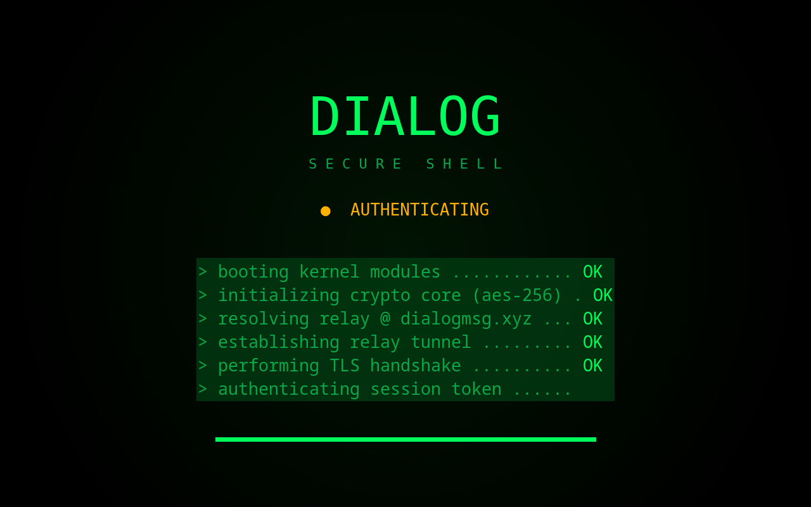

<div align="center">


# Dialog

**A fast, self-hosted messenger — chat, peer-to-peer voice & video, and screen sharing.**
In your browser, on your desktop, and on Android.

[](https://dialogmsg.xyz)
[](https://dialogmsg.xyz/download)
[](LICENSE)


[**Open Dialog →**](https://dialogmsg.xyz/login) · [Download apps](https://dialogmsg.xyz/download) · [Bot API](https://dialogmsg.xyz/bots) · [Privacy](https://dialogmsg.xyz/privacy)



</div>

---

## Features

### Messaging
- **Direct & group chats** with reactions, edits, replies (quote + jump back), forwarding,
  voice notes, GIFs and file sharing up to 75 MB.
- **Channels** — broadcast groups where only the owner, bots and an incoming webhook may post.
- **Search inside a chat**, jump to a date, pin a message, select several at once, per-chat
  drafts, and Saved Messages (a chat with yourself).
- **Swipe** a message left to reply, right to forward.
- **Markdown**, inline link previews, and an image editor (rotate · flip · crop · resize)
  that runs before anything is uploaded.

### Calls
- **Peer-to-peer voice & video.** Media flows directly between participants over WebRTC —
  there is no media server in the path, so calls cost nothing to run and no third party
  handles the stream. Dialog's server only does signalling.
- **Screen sharing**, per-participant volume, push-to-talk, noise suppression (off by
  default), and a mic test + camera preview in settings before you dial.
- STUN/TURN is used only when a direct path can't be established.

### Accounts & privacy
- **Two-factor authentication** (TOTP), a list of signed-in devices you can revoke
  individually, and a session self-destruct timer that also wipes local data.
- **Rich presence** — show what you're playing, or hide it from everyone, or from one
  specific person.
- Online / do-not-disturb / invisible status, friend and block lists, per-chat auto-clear.
- **Export** your whole account as JSON, whenever you like.

### Platform
- **Bots** — a Telegram-style HTTP API with `getUpdates`, signed webhooks, inline keyboards
  and callback queries. See [`docs/bots.md`](docs/bots.md) or
  [dialogmsg.xyz/bots](https://dialogmsg.xyz/bots).
- **Themes** — a theme studio with a live desktop/phone preview, plus a workshop for sharing.
- **Native desktop apps** with a system tray, auto-update and a terminal boot screen.
- **Android app** — native WebView shell with native notifications and calls.
- **Self-hostable.** One `docker compose up`, and the data is yours.

## Download

Get the app for your platform at **[dialogmsg.xyz/download](https://dialogmsg.xyz/download)**, or from
[GitHub Releases](https://github.com/VanylixCODER/Dialog/releases). Or don't install anything —
it runs in the browser at **[dialogmsg.xyz](https://dialogmsg.xyz/login)**.

| Platform | Format |
|---|---|
| Windows | `.exe` installer · `.exe` portable (no install) |
| macOS | `.dmg` / `.zip` (universal) |
| Linux | AppImage · `.deb` · `.pacman` · `.flatpak` |
| Android | `.apk` |

## Tech stack

Node.js · Express · Socket.IO · MySQL 8 · Redis · WebRTC (calls) · Web Push + FCM ·
Electron (desktop) · Android WebView (Kotlin).

No build step for the frontend — it is plain JavaScript and CSS served as-is. Attachments
are stored on disk by content hash rather than in the database, and served with a strict
content-type allowlist.

See [`docs/STRUCTURE.md`](docs/STRUCTURE.md) for a file-by-file map of the repository.

## Run it yourself

Requirements: Docker (or Node 20+, MySQL 8, and optionally Redis).

```bash
git clone https://github.com/VanylixCODER/Dialog.git
cd Dialog
cp .env.example .env      # fill in DB_* at minimum
docker compose up -d      # app + MySQL + Redis
# → http://localhost:3000
```

Without Docker: `npm install && npm start`, with `DB_*` pointing at your MySQL.

### Environment variables

Only the database is required. Everything else degrades gracefully — no Redis means no
cache, no VAPID keys means no web push, no TURN means calls fall back to a direct
connection only.

| Var | Purpose |
|---|---|
| `DB_HOST` · `DB_PORT` · `DB_USER` · `DB_PASS` · `DB_NAME` | MySQL connection (set `DB_PORT=3306` explicitly) |
| `PORT` | Server port (default `3000`) |
| `APP_URL` | Public origin, used in emails and webhook URLs |
| `REDIS_URL` | Optional cache, e.g. `redis://localhost:6379` |
| `UPLOAD_DIR` | Where attachments are written (default `./.uploads`) |
| `TURN_URL` · `TURN_USER` · `TURN_PASS`, or `METERED_API_KEY` | TURN relay, for peers that can't connect directly |
| `VAPID_PUBLIC` · `VAPID_PRIVATE` · `VAPID_SUBJECT` | Web Push |
| `FCM_SA` or `FCM_SA_PATH` | Firebase service account, for Android push |
| `RESEND_API_KEY` · `MAIL_FROM` | Verification and password-reset email |
| `GIPHY_KEY` | GIF search |
| `ADMIN_LOGINS` | Comma-separated logins that get the admin panel |

## Apps & releases

- Desktop and Android shells live in [`desktop/`](desktop/) and [`android/`](android/). Both are
  thin wrappers around the hosted app, so web changes reach them without a rebuild.
- Cutting a release is documented in [`RELEASE.md`](RELEASE.md).

## License

Dialog is licensed under the **GNU Affero General Public License v3.0 or later**
([AGPL-3.0-or-later](LICENSE)). You're free to use, study, modify and self-host it — but if
you run a modified version as a network service, you must offer your modified source to its
users under the same license.
